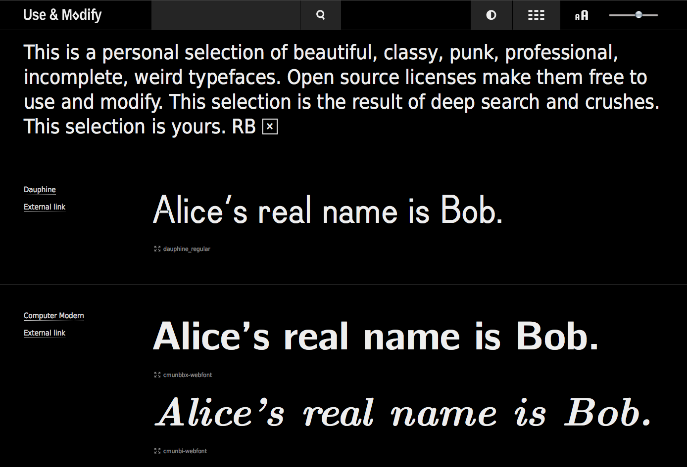

# Mardi 2 avril

-The Valentina Project
Patternmaking Software
what is creating clothes
free tools for create clothes
- Metapolator
- Font Bakery
- Gimp

=> The forkable repository
  If not stated otherwise permission is granted to copy, 
  distribute and/or modify these documents under the 
  terms of any of the following licenses:

http://www.forkable.eu/

collaboration has been a focus
Free & libre type = next issue

### Where the users are
Statistic
Blender - le logiciel le plus utilisé = logiciel de 3D 
les utilisateurs s'aident de manière collaborative par la contribution
 
### The screenless office - Brendan Howell
un artistic operatic systeme
a nouveau way to dealing with media : without screen
whats wrongs with screens ? they started to dominate the word / et ils définissent un cadre / inside and outside de screen
shuting down the rest of the word. 
Why new media sucks in '14 ? Interface crapy / full of content
The screen stole the spotlight

As artist and programmer
prendre la plainte pour le transformer en quelque chose d'intéressant

interface / chacun a le droit de définir comment il veut avoir accès a son interface
il ne devrait pas être obligé de choisir l'interface par défaut de google.
=> interface personnalisé/ reprendre les interfaces en main.
Question sur les interfaces.

>The Screenless Office is an artistic operating system for >working with media, that eschews the use of a raster-based >display. The goal of the project is not to produce techniques >that can be justified in terms of speed and efficiency. Instead, >the office seeks to describe an alternative phenomenology of >everyday human interaction with media. The system is >constructed using free/libre/open hard- and software >components, especially for print, databases, web-scraping and >tangible interaction. The talk will explain the artistic rationale >and implementation choices, as well as show media->archeaological research and experimental results. 

### Workshop Christoph Haag, Femke Snelting - Operating Systems
**AN ETHERPAD COLLECTIVELY EDITED**

Travail collaboratif sur un document
Le design doit il se faire seul ou en groupe ?

 >"Since 2001 we are working together as LAFKON Publishing, 
 >doing research, experimentation and commercially applied 
 >design. The conviction that our process of design may not
 >be reducable to the styling of surfaces** has led to 
 >a continous research on the application and bending of 
 >design technologies as access to visual for."

=> éditer un document _Etherpad_
Après un travail contributif = éditer le texte / une version organisé / designer
Peut être faire ça en groupe
Typesetting (=composition)
collaboration sur différent échelle

Il s'agit de définir le style de manière collaborative pendant que les personnes utilise l'etherpad. La collaboration est poussée un cran plus loin.

=> ajouter de la sémantique dans le texte /
pour le moment le texte et brut / ajouter des métadonnées ?

**In the same as designers collaborate with printer / Is now time that designer collabore with developers. To master their tools**

Ce workshop s'adresse à des designers, artistes et developpers qui sont interessés par une utilisation alternative des softwares.

>Using operating systems as metaphor we try to imagine >systems that are both structured and open.  What kind of >conditions are needed for collaboration and exchange? What >granularity of modules do we need, and what possible >connections can we make? We try to think not just about >software, but extend to standards, fileformats and actual >creative work. 

Christoph Haag. Approaching graphic design from the commandline and the commandline from a design perspective, he is currently extending usage into programming. Lives and works in Augsburg, Germany.

Il utilise les actions de commande ordinateur pour produire de la mise en page.

### G'MIC
Image processing framework
script langage
plugging for Gimp - effect that you can apload 
filtre sur image tres developpé

### Jonas Öberg - Contextualizing Creative Works
Ordinateur qui attribue directement des données aux images
Commons machinery / automatisé le process d'attribution

Impossible de se rappeler les licences .. ect
demandé au machine de se rappeler le contexte des images - metadata
que les metadonnées fassent partie de l'image 

Les services qui gardent les métadonnées / exemple : Facebook supprime toutes les données - google les garde bien

Eloglo: - un outil qui permet de rappeler toutes les activités qui arrivent à une image
si elle est modifiée dans gimp
elle garde avec l'image les informations 
-keeping a record - database
suivre avec l'image les données qui la concerne / de la création au remixe
des outils qui retiennent l'information

**=>Metadata in créative work => Friday 10:30**

www.commonsmachinery.se

### Keeping Metadata in Creative Works - Artem Popov
Un outil qui permet de copier coller les metadonnées avec l'image. 
RDF: triple / descripte information about a photo

Handling metadata in remix work

https://github.com/commonsmachinery

Today, most multimedia creation tools have little or no support for tracking metadata of individual project parts, such as layers, objects or clips. This talk will demonstrate a proof-of-concept implementation of keeping layer metadata in Gimp, discuss the challenges involved and how the process can be generalised to a wider range of tools.
Artem Popov is a developer at Commons Machinery, working on improving metadata support in digital media creation and publishing software.
commonsmachinery.se

*interactive visualisation*
use interactive visualisation in collaborative learning - 
- vannevar Bush - memex
collaboration en plus de outils de base de visualisation

### Beating the drums: Why we made gender an issue
genre issu in the libre graphic meeting
FLOSS 
probleme de représentation
LENA - utiliser des images de femme sexy dans les présentations. 

"we should be beating more drumbs"
more inclusive society

Friday 

# Mardi 3 avril
Je me rends compte grace au festival sur l'open source que l'open source va plus loin que liberer les sources. Les questions ou enjeux sont souvent différent plus sur la notion de qualité, de partage, de création, d'échange. L'ouverture des sources est ici une base aquise, il est tres peu question d'open source finalement. Tous ce fait en open source, cependant les questions ici sont les projets que l'on peut faire grace à l'open source. Certain propose de nouveau outils pour augmenter la capacité des outils libres. Ici, la notion d'outil me semble large. Ca peut etre un logiciel qui traite des images mais ca peut ausi être un..

### Øyvind Kolås - 0xA000 a font family
http://pippin.gimp.org/0xA000/
The story of a raster/pixel inspired font-family, from a prototype generated in one night; through a year of tool creation and improvement, constraint re-evaluation and design iteration - ending up with a generative design framework for constructing modular fonts. The 0xA000 font-family experiments with alternative workflows for generating fonts, sitting somewhere between ascii-art and metafont. The pipeline that will be detailed includes text editors, fontile, the UFO file format, kernagic, fontforge and ttfautohint.

### Simon Egli - Chicken & Eggs - Designing font families with Metapolator
http://metapolator.com/
Permettre a tout le monde de créer des typos / comment étendre une famille
un logiciel qui permet de créer des familles
construire un squelette de la lettre - 
un paramettreur / 
créer un parametteur
préndre contrôle de la forme et ajouter rapidement des variations
_"turn any existing typeface into a skeleton font and control it"_

Ce qui rend Metapolator special c'est qu'il permet de créer 

>Metapolator is a web-based parametric font editor. It provides >a GUI for designing with UFO fonts and Metafont – a language >for semi-algorithmic specification of typefaces. Metapolator >was created out of the need to create large font families >efficiently. Presentation of development process of the editor >and showcase of typefaces produced with Metapolator

### Edward Trager - Hariphunchai: Designing a Tai Tham Unicode Font
Tai Tham script = langue
Une volonté de préserver les héritages du passer , ainsi préserver la culture de l'écriture manuscrite du Tai Tham script 
Il existe plusieurs sites Internet qui supportent ce language. Et qui permettent d'avoir accès à cette culture
Les problems c'est qu'il n'existe pas d'unicode pour le Tai Tham.

### What does it change to created with open source / 
Créer un blog / entre un blog et un site internet
plutot interessé par l'echange et le histoire derrière ca
"I care"
Open source projet performing the idée of "I care" - créer un dialogue
donner les ressouces / les ingredients mais c'est aussi donner l'histoire derrière le projet
Utiliser l'open source comme un systeme pour parler de l'histoire
Un speciman qui sert comme une histoire - detailler l'histoire d'une typographie
Connecter ces différents projets - textes - essais

### Raphael Bastide
=> Best talk

### Simon Budig - Fonts in Printed Circuit Board design tools
Comme améliorer l'impression de typographie sur les circuits électrique

### Juraj Sukop
Flat – Generative infrastructure for Python
tu fabrique d'abord une machine qui produira des formes ensuite
Il peut faire des mises en page grace a son logociel

Flat — Generative infrastructure for Python
Flat is a library for creating and manipulating digital forms of fine arts. Its aim is to enable experimentation with and testing of unpredictable or automated processes, to inspect the beginning of the "new".
It grew out of the needs for generative design, architecture and art. The concept of "design" is more of a subject of study yet to be delved into, hence the fitter term for subtitle is "infrastructure".
It is written in pure Python and distributed under a liberal license.

### Back to the Future - Christoph Haag
"I took the chance to explore a world of software and approaches which were new for me, but actually have been around for quite some time. In which way does this 'step back' in computing history provide any insights for my current and future use of tools? The talk collects failures, learnings and attempts that contribute to my current conception of a F/L/OS approach to design, graphic design in particular."

Back to 1970
 retour to computing time
celebrating 40 ans
2007 - first introduction in GNU
The unix philosophy 
=> dans mon mémoire faire la liste des principes de création

Make art 2009 
What the Fork  ? - exposition dans un festival
how many stuf I can connecte and what can I do with ?
Il a programmé un process et des chose en sont sorti

Fork of make art festival -
Il réutilise le meme moteur mais il change quelque partie

Futur Tools
ASCII 

# Jeudi 4 avril

### Workshop

Si les gens sont sur qu'il peuvent être crédité alors ils sont interessé pour partager
Open media
Discussion
based on RDF
dérivation of this - 
Comment and note around image
montrer toutes les relations entre les éléments 
catalogue 
annotation concept for images 
image qui existe sur différente place / comment comprendre qu'il n'y ai qu'une seule place pour une image qui une multiple position. comment comprendre la rentré

Au depart c'est partir sur l'individualité . il commence par eux dans leur présentation
Crowdsource - par le travail de la masse retrouver les sources

Mettre ses images sur Flickrs
In barcelona:
Un outil qui permet de connaitre les licences par des couleur rouge orange vert
et montrer les plateformes plus ou moins dangeureuse en terme de licence

Copy and pasting / when you copy something - les données viennent avec
est ce que l'outil est capable de montrer ce qui interessant et de cacher ce qui ne l'ai pas.

A colage - comment vous gérer le mixe de donnée dans le cas d'un collage ?
Open video - utiliser Xml 
Mettre des metadata sur des videos - mais ce n'est pas quelque chose qui interesse les producteurs

L'idée forte est le fait que les Metadonnées soient comprise dans le copié collé.
A la fois les crédits et le fils des auteurs

C'est aussi le moyen de montrer au gens que les credits sont importants
Que les credits font parti de l'image

Les videos sont dans un sens plus stable car elle sont pas facilement recadrable
Rendre toute les images que je fais partagable mais aussi tracable jusqu'a moi.
Les gens seront plus interessé pour partager s'ils savent que leur image garde leur trace

Personne that are accidentaly creator
Créer un bouton similaire sur les téléphones pour copié les credits avec l'image
Créer différent "partage" possible / 
Un peu comme les différents commons :
	- créer des "partage" different en fonction des utilisations qui en sont faite.

Vous pouvez ajout un bouton mais choisir exactement les fonctions que ce lui ci va faire. Ainsi personnalisé son bouton / Toujours copier les sources

Dans un premier temps c'est deja donné la possibilité au utilisateurs d'avoir acces au credit et de les copiers rapidement
et voir comment il réagissent par rapport a cela
Et comment le travail est augmenté par cela

Are people going to find that usefull

http://commonsmachinery.se/

### Myriam Cea - Libre Graphic Workstation at Medialab-Prado Madrid
D'individuel à collectif vers individuel again

### Femke Snelting, Alex Leray - Relearn (Variable Summerschool) 
In art school 
Free software make the back visible - it help to make in account
summer school 
make the softwatevisible - knowlegde echange in freesofware chalange the way it's done normaly
- from digital to 

- Offprint 

3 principales:
- did'nt when to do a workshop
- mixing theachers / students 
expect et amateur

le social share:
ecrire collaborativement - partage de la documentation / fictional
new interface / collaborative interface
Chaque pile est une nouvelle histoire

open cour
relearn.be
apply: registration@relearn.be
submit a proposal:
relearn.be/ether/p/proposals-2014
Think about invate 1 guest during that worksession
Budget

>Relearn is a temporary artschool without teachers or rather it >has as many teachers as it has participants. It is about sharing >and trying new cultural practices, and is entirely running on >Free, Libre and Open Source software. 

###Sub-etha edit
is a Mac text editor with real time collaboration
Google wave = question reponse / plus editing in the question and in the response
il utilise l'etherpad pour ecrire tous ensemble le css et donc composer le design ensemble
retourner le process, utiliser le code pour produire un livre 
utiliser a la fois un outil Asynchrone = git and synchrone = etherpad

Realtime Collaborative Graphviz
The new etherpad
great: beacause easy to install easy to modify and easy to extend
A partir de note aller vers une forme de layout - toutjour de manière collanorative 

 	

### OSP Open Source Publishing, Eric Schrijver, Stéphanie Vilayphiou - Ethertoff release announcement 
OSP releases a wiki built around the popular Etherpad Software. Easy to install as an Etherpad-plugin, Ethertoff allows groups of collaborators to write text, but to also edit the corresponding stylesheets and to generate a PDF version. Designed for fluid transitions between writing, editing and designing, Ethertoff seeks to redefine the space of collaborative writing and of book sprints.

# Samedi 5 avril

### Font bakery 
Not an offical google product
Dans google font il y a 1000 fonts, 
encourga direct community contribution

Une integration continuelle des évolutions des typographies basé sur le travail d'une communauté

Créer une grande plateforme de typographie ou chacun pourrait modifer et réintégrer les changements sur cette meme plateforme. Avec des outils comme Metapolator par exemple.
Une grand plateforme qui integre automatiquement les modifications apporté aux typographie + les réutilisations faites de ces projets.

Font Bakery. Font continuous product. piece of free software can perform for font publication. Continus integration. Keep font source in Git.
https://github.com/googlefonts/fontbakery
"Font Bakery is a font build service. The vision is to bring the Continuous Integration best practices of software development to type design.
You give it a font project git repository, tell it which license the project is under, which font source files you wish to build into binaries, and set some build options. It then runs tests on the sources, and if they pass, builds the fonts and runs further tests on the binaries.
You can publish your git repository conveniently on Github. If you wish to host your own repository, GitLab HQ can be helpful.
This project is under active development by Vitaly Volkhov and Dave Crossland. The first year of development, including the code architecture and design, was done by Mikhail Kashkin."

Announcement about a new release for color management implemented into free-software

French Art/graphics creator. Krita contributor. Drawing and painting application. released an early access version. 

>Font Bakery is a continuous integration server for fonts >developed collaboratively using Git. In addition to a standard >UFO compilation process, written in Python and driven by >Fontforge, it offers a battery of tests that prove quality of >sources and binaries, and point to future work to be done. This >presentation will conclude with future possibilities and invite >discussion about the future of collaborative type design. 100% >Python, the build and tests are easy to modify and extend.

### Inklinging
c'est l'oposé d'une tablette graphique / c'est sur un papier réel et avec des liens qui donne un tracé vectoriel
permet de dessiner directement sur un papier et d'integrer cela dnas un ficher numérique.  
Inkling fait le lien entre l'esquisse traditionnelle et le développement numérique. Pendant que vous dessinez sur papier à l'aide d'un stylo à bille, Inkling capture vos esquisses sous forme numérique, trait par trait.

### Superglue
spaces and shape 
Reranger les pages - avec des outils que l'on connait
Use and modify appliqué au site internet. La notion de hack et de modification
Prendre internet comme une matière de création

##### From their web site: Superglue.it
Web 2.0 promised that everyone could become a media publisher, but had exactly the opposite result: Today, most people's web content is locked into the proprietary services of only a handful of Internet social media giants. The early Web culture of self-made and self-hosted homepages has almost disappeared.

A major reason for this is that corporate social media systems were much easier to use than classical homepages. Users no longer need to administer servers or upload HTML files. With SuperGlue, we are developing a system that gives back everyone their truly own website. For this purpose, we build on our existing HotGlue web application - which makes the creation of web sites as easy as the use of basic text and painting programs -, but improve it so that it no longer needs to run on a central server.

### Libre Graphic Magazine
Des designers graphques qui ont changé leur pratique vers les outils open source
Aider les designers a changer. Est ce que F/LOSS is cool ?
Il est facile quand les étudiants n'ont jamais touché un logiciel . cependant une fois que les designers sont habitué aux outils Adobe il est plus difficile de quitter ces habitudes.

Il est difficile de changer d'outils, c'est un projet complexe et long
La transition est long, il faut tout réapprendre

Ils proposent un libre graphique kit:
Une boite ou tu peux copier tout ce que tu veux dans une university
Comment faire que les gens viennent plus proche de la culture du libre. 
Il font une comparaison entre suite d'abode et les suites de l'hotel. A l'hotel il y a une serie de choses automatisé, vous loué la pieces et les meubles. Tout ce la est privé. Vous ne pouvez pas réagenger les choses dans votre chambre. Pourquoi les gens restent dans l'hotel ? Parce que c'est confortable ?

Cependant quand les appartements particulier il y a de la diversité.
Avec l'habitude de n'utiliser que l'hotel les personnes ne savent plus faire leur lit. 
Ainsi on perd la diversité.

How can we make F/LOSS irrestible ?
G/LOSSY - help designers to go to free software
http://www.kitgrafica.manufacturaindependente.org/

###Sarup Banskota, Emily Dirsh - GlitterGallery: Taking the designer's office online

Un outil pour collaborer pour les designers
Open source design
Les designers utilisent mailing list pour collaborer
ils veulent le remplacer par quelque chose de plus utile

Exemple de Medium 

@sarupbanskota

